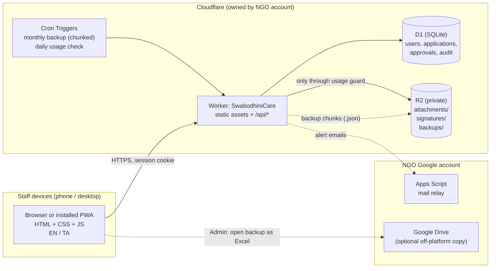
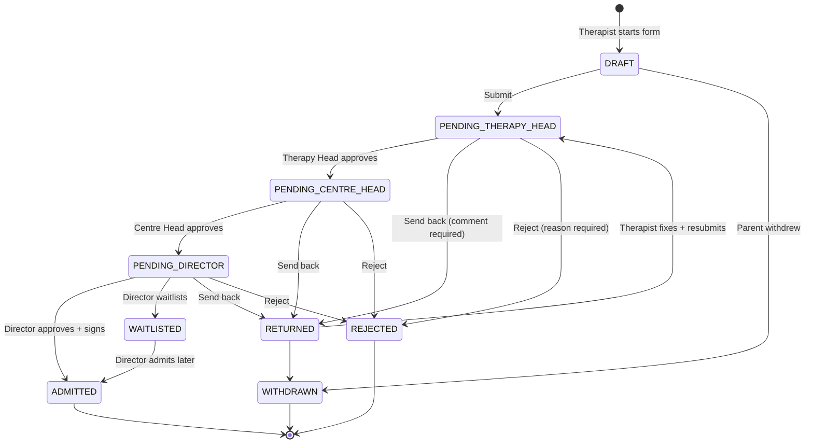

# SwabodhiniCare — Design Spec (v0.3, POC)

| | |
|---|---|
| **App** | SwabodhiniCare |
| **Organisation** | Swabodhini Autism (NGO), Chennai — https://swabodhiniautism.org/ |
| **Purpose** | Digital registration / assessment → approval → admission workflow |
| **Status** | Draft for review — POC. **Free plans only, ₹0 running cost** |
| **Date** | 2026-09-15 |

---

## 1. Goals and non-goals

### Goals
1. Staff fill a **combined enquiry + assessment form** on a phone, asking the parent the questions.
2. The application goes through **Therapy Head → Centre Head → Director**. The Director's stored signature is applied when they approve.
3. **Reports** let management decide whether each applicant can go further, and summarise registrations across centres.
4. **Tamil and English** everywhere in the app.
5. The design suits **older users**: large text, large buttons, a simple step-by-step flow.
6. **Phone first**, works on desktop, and can be **installed as an app** (PWA, install-only).
7. **Close to zero maintenance.** No runtime dependencies that anyone needs to patch.
8. **Automatic monthly backups** that can be opened as Excel.
9. **₹0 running cost**, with an in-app guard that makes accidental charges effectively impossible.

### Non-goals (POC)
- Parent logins or a parent-facing portal
- Fees, billing, attendance, therapy-session tracking
- Filling forms offline
- Notifications about applications to staff or parents (SMS, WhatsApp or email). The POC shows in-app queue counts. The only emails are **system alerts to the Admin** (§11.4)
- Self-service password reset by email

---

## 2. Decisions log

| # | Decision | Choice | Why |
|---|---|---|---|
| D1 | Frontend | Plain HTML + CSS + JS (ES modules), **no framework, no build step, no npm runtime dependencies** | Nothing can go out of date or get a security advisory that someone has to patch |
| D2 | Backend / hosting | **Cloudflare Workers** (one Worker serves the static files and the `/api/*` routes) | A pinned `compatibility_date` means our code keeps running unchanged; Cloudflare patches the runtime; no idle pausing |
| D3 | Database | **Cloudflare D1** (managed SQLite) | Real transactions and concurrency safety (Excel has neither). A 7-day point-in-time restore comes free but is not relied on (D18) |
| D4 | File storage | **Cloudflare R2** (private bucket) | Photos and PDFs; no fees for downloads |
| D5 | Excel | **Export format, not the database** | Management gets Excel downloads on every report and in the monthly backup |
| D6 | Vercel | **Not used** | Its filesystem can't store data; the Hobby plan is for personal, non-commercial use; it adds nothing without Next.js |
| D7 | Approval chain | **Sequential**: Therapy Head → Centre Head → Director | Clinical review first, then admin/capacity review, then final sign-off |
| D8 | Centres | **4 centres, shared data**; the centre is a field used in filters and reports | Confirmed by user |
| D9 | Uploads | **Photo + PDFs from the phone** (camera or gallery) | Confirmed by user |
| D10 | Form stages | **One combined form** filled by the therapist | Confirmed by user |
| D11 | Access | **Login only.** "Campus use" is a policy, not enforced technically | IP restriction breaks on mobile data and when the ISP changes the IP |
| D12 | Password reset | **Admin sets a temporary password**; the user must change it at next login | No email provider to run |
| D13 | Director signature | **Uploaded once, stamped on approve**, after the Director re-enters their password | Legally meaningful and simple for the Director |
| D14 | PWA | **Install-only**: manifest + small app-shell service worker, network-first, **no data cached** | Home-screen icon for older users; no sync conflicts |
| D15 | Plan | **Free plans only**: Cloudflare Workers Free, D1 free, R2 free allowance, Google Apps Script (free). **No paid plan is used anywhere** | Confirmed by user. Every server request and cron run is designed to stay within the free plan's 10 ms CPU limit (§11.1) |
| D16 | Password hashing | **Done on the phone/browser** (PBKDF2, 600k rounds); the server does one SHA-256 | Moves the slow step off the server; the server never sees the password (§10.1) |
| D17 | Excel files | **Built in the browser** (`public/js/xlsx.js`) | Building Excel files on the server would exceed 10 ms |
| D18 | Backup | **Automatic monthly cron, in small chunks**, saved to R2 | Each cron run also gets only 10 ms. An undo/restore window is not required |
| D19 | Spend guard | **R2 free allowance + an in-app kill switch** set below the free limits | Cloudflare asks for a card before switching R2 on, **even for free use**. The Worker is the only way into R2, so the kill switch makes sure the card is **never charged** (§11.3) |
| D20 | Alert emails | **Google Apps Script Gmail relay** in the NGO's Google account | Free, and works without moving the domain's DNS (§11.4) |
| D21 | Alert frequency | **Once per day per alert** until it's resolved (not continuous) | Continuous emails flood the inbox and get ignored or marked as spam; Gmail also allows only 100 recipients a day |
| D22 | Spending cap | **Enforced in the app at $0**, not a $1 billing cap | Cloudflare can't stop services at a dollar amount, so the usage guard stops R2 use before any billable usage (§11.3) |

---

## 3. Architecture



### Why this counts as "zero maintenance"

| Layer | Who maintains it | What we maintain |
|---|---|---|
| TLS, DDoS protection, servers, OS, runtime | Cloudflare | Nothing |
| Database engine, durability, encryption at rest | Cloudflare | Nothing |
| Our code | Us | About 3–4k lines of plain JS with **zero runtime dependencies**. Pinned `compatibility_date`, so there are no forced upgrades |
| Alert mail relay (Apps Script) | Google runs it | About 20 lines, no libraries |
| Dev tooling (`wrangler`, Playwright) | Only matters when a developer deploys | **Not shipped** to production, so its advisories don't affect the running app |

**What still needs a human** (all done by the NGO Admin, no developer needed):
- Add or deactivate staff, reset passwords (a few minutes each)
- Nothing for backups: they run automatically. Saving an Excel copy to Google Drive each quarter is optional (2 minutes)
- Act on alert emails (storage nearly full, backup failed). These should be rare
- Keep the Cloudflare account's 2FA recovery codes safe

---

## 4. Roles and permissions

A user can hold **several roles** (e.g. a Centre Head who also does assessments).

| Capability | Therapist | Therapy Head | Centre Head | Director | Admin |
|---|:-:|:-:|:-:|:-:|:-:|
| Create and fill an application | ✅ | ✅ | ✅ | — | ✅ |
| Edit own draft / returned application | ✅ | ✅ | ✅ | — | ✅ |
| View applications they created | ✅ | ✅ | ✅ | ✅ | ✅ |
| View **all** applications | — | ✅ | ✅ | ✅ | ✅ |
| Stage 1 review (Therapy Head) | — | ✅ | — | — | — |
| Stage 2 review (Centre Head) | — | — | ✅ | — | — |
| Final decision + signature | — | — | — | ✅ | — |
| Reports + Excel export | — | ✅ | ✅ | ✅ | ✅ |
| Manage users and roles, reset passwords | — | — | — | — | ✅ |
| Backups, usage meters, audit log | — | — | — | ✅ (view) | ✅ |
| Reopen an approved application (reason required) | — | — | — | ✅ | ✅ |

**Separation-of-duty rules**
- A user cannot review or approve an application they filled.
- A user cannot approve two stages of the same application.
- Admin is **not** an approver unless they also hold that approver role.

---

## 5. Workflow



**Rules**
- Each reviewer has three buttons: **Approve**, **Send back** (comment required) and **Reject** (reason required). The Director also has **Waitlist**.
- A resubmitted application **starts the chain again** at the Therapy Head. Earlier comments stay visible in the history.
- On **Approve**, the Director re-enters their password (step-up authentication). The system then:
  - gives it a registration number, `SWB/<CENTRE>/<YEAR>/<SEQ>` (e.g. `SWB/TVM/2026/0012`)
  - stamps the Director's stored signature, name and time on the printable form
  - stores a **SHA-256 hash of the form data** with the approval, so any later change can be detected
  - locks the application as read-only
- The workflow is a **pure function** (`lib/workflow.js`): `next(state, action, actorRoles) → newState | error`. It is unit-tested for every transition.

Centre codes: `TVM` Thiruvanmiyur, `VLC` Velachery, `TDP` Tondiarpet, `SLR` Selaiyur.

---

## 6. Application form (first draft)

> The form is **defined by a schema** (`shared/form-schema.js`): sections, fields, types, EN/TA labels, required flags, options and show/hide conditions. **The browser and the Worker import the same file.** The browser uses it to draw the form and the server uses it to validate. Changing the POC form means editing one file.
> Tamil wording below is a first draft. **School staff must review all Tamil strings.**

Answer style suited to older users: big tap-buttons instead of typing wherever possible. For abilities: **Independently / With help / Not yet** (தானாக / உதவியுடன் / இன்னும் இல்லை).

| # | Section (EN / TA) | Fields |
|---|---|---|
| 1 | **Centre & Enquiry** / மையம் மற்றும் விசாரணை | Centre*, enquiry date* (defaults to today), how they heard (Doctor / School / Parent / Internet / Other), programs of interest (multi: Special Education, Vocational Training, Occupational Therapy, Speech Therapy, Yoga, Play, Dance, Life Skills, Sports, Assisted Employment) |
| 2 | **Applicant Details** / விண்ணப்பதாரர் விவரங்கள் | Full name*, name in Tamil, date of birth* (day/month/year dropdowns; age calculated automatically), gender*, mother tongue, languages at home, **photo**, UDID / disability certificate (Have / Applied / No), UDID no. and % (if Have). **No Aadhaar number** is stored; only "Aadhaar available: Yes/No" |
| 3 | **Parent / Guardian** / பெற்றோர் / பாதுகாவலர் விவரங்கள் | Father's name, occupation, phone; mother's name, occupation, phone; guardian (if different) and relationship; primary contact*; WhatsApp number; address*, area, pincode; monthly family income band (for fee concession); siblings (count, any with disability) |
| 4 | **Diagnosis & Medical** / நோயறிதல் மற்றும் மருத்துவ வரலாறு | ASD diagnosed? (Yes / No / Suspected)*, diagnosed by (doctor/hospital), age at diagnosis, other conditions (multi: ADHD, Intellectual disability, Epilepsy/seizures, Cerebral palsy, Hearing, Vision, Down syndrome, Other), current medicines, allergies, previous assessments (CARS / ISAA / IQ / Other) with score, **diagnosis report PDF upload** |
| 5 | **Developmental History** / வளர்ச்சி வரலாறு | Birth: full term / preterm, complications (Y/N + note), birth weight; milestones, each **On time / Delayed / Not yet**: neck holding, sitting, walking, first words, toilet training |
| 6 | **Current Abilities** / தற்போதைய திறன்கள் | Communication (Speaks sentences / Few words / Non-verbal / Gestures / Uses AAC); eye contact; responds to name; follows instructions; eating; toileting; dressing; plays with others; sleep problems |
| 7 | **Behaviour & Sensory** / நடத்தை மற்றும் புலன் உணர்வுகள் | Each **Never / Sometimes / Often**: hyperactivity, aggression, self-injury, tantrums, repetitive behaviours, sensitivity to sound / touch / light, **wandering off (safety flag)** |
| 8 | **Education, Work & Therapy History** / கல்வி மற்றும் சிகிச்சை வரலாறு | Previous schools; current therapies (type, where, how often). **If age ≥ 18:** work / vocational experience |
| 9 | **Parent's Concerns & Expectations** / பெற்றோரின் கவலைகள் மற்றும் எதிர்பார்ப்புகள் | Main concerns (text; Tamil voice typing works through the phone keyboard), expectations from the school |
| 10 | **Therapist Observation & Recommendation** / சிகிச்சையாளரின் கவனிப்புகள் மற்றும் பரிந்துரை | Observation notes*, suitability* (**Suitable / Needs further assessment / Not suitable for our programs**), recommended program(s)*, recommended therapies, suggested centre, priority (Normal / Urgent) |
| 11 | **Consent** / ஒப்புதல் | Consent statement in EN + TA (DPDP Act 2023: verifiable parental consent for a child's data)*, parent/guardian name*, relationship*, **signature drawn on screen***, date (automatic) |
| — | *Review trail (system)* | Therapy Head comment/decision, Centre Head comment/decision, Director decision, signature, registration no. |

`*` = required to submit. Drafts can be saved with anything missing.

**Storage approach.** A few key fields are real columns for reports: centre, name, DOB, gender, status, suitability, programs. The **full form is stored as JSON** alongside a `form_version`. SQLite's `json_extract()` can still query any field. So new questions don't need a database migration, which suits a POC where the form will keep changing.

---

## 7. Reports

All reports have filters (centre, date range, status, program, age band) and a **Download Excel** button; the browser builds the file (§11.1). Charts are plain CSS bars (no chart library).

| # | Report | For | Answers the question |
|---|---|---|---|
| R1 | **My Queue** (home screen) | Everyone | "What needs my action?" Big count cards: *3 waiting for you* |
| R2 | **Individual Assessment Report** (A4 print / Save as PDF) | Heads, Director | "Should this applicant proceed?" All sections, suitability, review trail, Director's signature |
| R3 | **Application Register** | Heads, Director, Admin | Every application with status, centre, dates, therapist, suitability |
| R4 | **Monthly Summary by Centre** | Director, Admin | Numbers per centre per month: submitted → admitted / waitlisted / rejected |
| R5 | **Pending & Turnaround** | Director | Where applications are stuck; average days per stage; items older than 7 days highlighted |
| R6 | **Waitlist** | Director, Centre Heads | Waitlisted applicants by centre, program and date |
| R7 | **Demographics** | Director, Admin | Age bands, gender, co-conditions, UDID status, income bands. **Useful for CSR / donor / grant reports** |

Printing uses the browser's own **Print → Save as PDF** with an A4 print stylesheet. There is no PDF library.

---

## 8. Data model (D1 / SQLite)

```sql
users (
  id INTEGER PRIMARY KEY,
  email TEXT UNIQUE NOT NULL COLLATE NOCASE,
  name TEXT NOT NULL,
  phone TEXT,
  password_hash TEXT NOT NULL,          -- SHA-256 of the key derived on the device (§10.1)
  password_salt TEXT NOT NULL,
  kdf_iterations INTEGER NOT NULL DEFAULT 600000,
  must_change_password INTEGER NOT NULL DEFAULT 1,
  preferred_lang TEXT NOT NULL DEFAULT 'ta',   -- 'ta' | 'en'
  is_active INTEGER NOT NULL DEFAULT 1,
  failed_logins INTEGER NOT NULL DEFAULT 0,
  locked_until TEXT,
  created_at TEXT NOT NULL, updated_at TEXT NOT NULL
);

user_roles (user_id INTEGER, role TEXT CHECK (role IN
  ('ADMIN','THERAPIST','THERAPY_HEAD','CENTRE_HEAD','DIRECTOR')),
  PRIMARY KEY (user_id, role));

sessions (
  token_hash TEXT PRIMARY KEY,          -- SHA-256 of the cookie token; raw token never stored
  user_id INTEGER NOT NULL,
  created_at TEXT, last_seen_at TEXT, expires_at TEXT, user_agent TEXT
);

centres (id INTEGER PRIMARY KEY, code TEXT UNIQUE, name_en TEXT, name_ta TEXT,
         address TEXT, is_active INTEGER DEFAULT 1);

applications (
  id INTEGER PRIMARY KEY,
  app_no TEXT UNIQUE NOT NULL,          -- e.g. APP-2026-0042 (assigned at creation)
  registration_no TEXT UNIQUE,          -- assigned on ADMITTED
  centre_id INTEGER NOT NULL,
  status TEXT NOT NULL,
  applicant_name TEXT NOT NULL, dob TEXT, gender TEXT,
  suitability TEXT, programs TEXT,      -- denormalised for reports
  form_json TEXT NOT NULL, form_version INTEGER NOT NULL,
  created_by INTEGER NOT NULL,
  submitted_at TEXT, decided_at TEXT,
  version INTEGER NOT NULL DEFAULT 1,   -- optimistic locking: stale saves are refused
  created_at TEXT NOT NULL, updated_at TEXT NOT NULL
);

approvals (
  id INTEGER PRIMARY KEY, application_id INTEGER NOT NULL,
  stage TEXT NOT NULL,                  -- THERAPY_HEAD | CENTRE_HEAD | DIRECTOR
  action TEXT NOT NULL,                 -- APPROVE | SEND_BACK | REJECT | WAITLIST
  comment TEXT, user_id INTEGER NOT NULL,
  form_hash TEXT NOT NULL,              -- SHA-256 of form_json at decision time
  created_at TEXT NOT NULL
);

attachments (
  id INTEGER PRIMARY KEY, application_id INTEGER NOT NULL,
  kind TEXT NOT NULL,                   -- PHOTO | DIAGNOSIS | UDID | CONSENT_SIGNATURE | OTHER
  r2_key TEXT NOT NULL, filename TEXT, mime TEXT, size INTEGER,
  uploaded_by INTEGER, created_at TEXT, deleted_at TEXT   -- soft delete only
);

signatures (user_id INTEGER PRIMARY KEY, r2_key TEXT NOT NULL, uploaded_at TEXT);

audit_log (
  id INTEGER PRIMARY KEY, user_id INTEGER, action TEXT NOT NULL,
  entity TEXT, entity_id INTEGER, details_json TEXT, ip TEXT, created_at TEXT NOT NULL
);

backup_jobs (
  period TEXT PRIMARY KEY,              -- '2026-10'
  status TEXT NOT NULL,                 -- RUNNING | COMPLETE | FAILED
  cursor_table TEXT, cursor_id INTEGER, -- where the next chunk starts
  chunk_count INTEGER NOT NULL DEFAULT 0,
  row_counts_json TEXT, error TEXT,
  started_at TEXT, finished_at TEXT
);

usage_counters (
  key TEXT PRIMARY KEY,                 -- 'r2_bytes_total' | 'r2_writes:2026-10-03' | 'r2_reads:2026-10-03'
  value INTEGER NOT NULL DEFAULT 0,
  updated_at TEXT
);

alert_log (key TEXT PRIMARY KEY, last_sent_date TEXT);   -- at most one email per alert per day
```

**Optimistic locking.** Every save sends the `version` the user loaded. If someone else saved in the meantime, the server refuses and the UI says *"Someone else updated this form. Tap to reload."* This is exactly the lost-update problem an Excel file as a database would have.

---

## 9. API (JSON, `/api/*`)

Every response uses the same envelope: `{ ok: boolean, data: any | null, error: { code, message_en, message_ta } | null }`.

| Method | Path | Who |
|---|---|---|
| POST | `/api/auth/prelogin` `{ email }` → `{ salt, iterations }` · `/api/auth/login` `{ email, key }` · `/api/auth/logout` | all |
| POST | `/api/auth/change-password` `{ current_key, new_salt, new_key }` (both keys derived on the device) | all |
| GET | `/api/me` | all |
| GET / POST | `/api/users` · PATCH `/api/users/:id` · POST `/api/users/:id/reset-password` `{ salt, key }` (the Admin's browser derives the temporary password's key) | Admin |
| GET | `/api/applications?status=&centre=&q=&from=&to=` | role-scoped |
| POST | `/api/applications` (new draft) | fillers |
| GET / PUT | `/api/applications/:id` (PUT = save draft, needs `version`) | owner / reviewers |
| POST | `/api/applications/:id/submit` | owner |
| POST | `/api/applications/:id/review` `{ action, comment }` | Therapy Head, Centre Head |
| POST | `/api/applications/:id/decision` `{ action, comment, key }` (password re-entered and hashed on the device) | Director |
| POST | `/api/applications/:id/reopen` `{ reason }` | Director, Admin |
| PUT | `/api/applications/:id/attachments?kind=&name=` (raw file body, streamed into R2) · GET/DELETE `/api/attachments/:id` | scoped |
| PUT | `/api/me/signature` | Director |
| GET | `/api/reports/:name?page=` (JSON in pages; the browser builds the Excel file) | Heads, Director, Admin |
| GET | `/api/admin/backups` · `/api/admin/backups/:period/chunks/:n` · POST `/api/admin/backups/run` (starts a chunked job) | Admin |
| GET | `/api/admin/usage` (usage-guard meters) | Admin |
| GET | `/api/admin/audit` | Admin, Director |

---

## 10. Security and privacy

This app holds **medical and developmental data about children**, the most sensitive kind of personal data.

### 10.1 Authentication
- **Passwords are hashed on the device** (the same pattern password managers such as Bitwarden use). The steps:
  1. The browser sends the email to `/api/auth/prelogin` and gets back that user's 16-byte salt and round count. For an **unknown email**, the server returns a fake salt, `HMAC(server_secret, email)`, which is always the same for that email. So no one can use this to find out which staff emails exist.
  2. The browser runs **PBKDF2-SHA256 with 600,000 rounds** (the OWASP 2023 recommendation) using Web Crypto, which is built in, so no library. This takes about 0.5–1.5 s on older phones; the screen shows *"Signing in…"*.
  3. The browser sends the 256-bit result (`key`). The server stores only `SHA-256(key)` and compares it in constant time. This uses under 1 ms of CPU.
  - **If the database leaked**, an attacker would still have to run all 600k rounds for every password they guess. The stored `SHA-256(key)` can't be used to log in.
  - The server never receives the plain password. Minimum 8 characters and a short list of banned common passwords are checked in the browser before hashing.
  - **Admin reset:** the Admin's browser creates a new salt and derives the key for the temporary password. The user must change it at their next login.
- **Lockout:** 5 failed attempts locks the account for 15 minutes. A per-IP login counter is kept in D1.
- **Sessions:** 32 random bytes in a `__Host-sid` cookie, set `HttpOnly; Secure; SameSite=Strict; Path=/`. Only the SHA-256 of the token is stored. **12-hour idle timeout, 7-day maximum.** Admin can end all of a user's sessions.
- **Step-up:** the Director re-enters their password on every final decision. It's hashed on the device the same way as at login.
- **First login / reset:** the user must set a new password.

### 10.2 Web protections
- **CSRF:** SameSite=Strict, plus the server checks the `Origin` header on every non-GET request, plus it requires `Content-Type: application/json`, or for raw uploads `image/jpeg`, `image/png` or `application/pdf`. A cross-site form can't send those types without a CORS preflight, and we never approve preflights.
- **XSS:** user data is never inserted with `innerHTML`; only `textContent` and DOM APIs are used. Strict CSP: `default-src 'self'; script-src 'self'; style-src 'self'; img-src 'self' blob: data:; frame-ancestors 'none'`. No inline scripts.
- **Headers:** HSTS, `X-Content-Type-Options: nosniff`, `Referrer-Policy: same-origin`, a `Permissions-Policy` that only allows the camera.
- **SQL:** only parameterised D1 queries (`.prepare().bind()`).
- **Validation:** every request body is checked against the shared form schema on the server. The client-side check is only for a better experience.

### 10.3 Files
- Allowed types: JPEG, PNG and PDF, checked by **magic bytes** on the server, not the file extension.
- Files are uploaded as the raw file body (`PUT`), not as a multipart form, and are **streamed** into R2. The Worker reads only the first bytes to check the type, so a 5 MB PDF uses almost no CPU. Every R2 call goes through the usage guard (§11.3).
- Photos are **shrunk in the browser** (canvas → JPEG, maximum 1600 px, about 300 KB), which also helps on slow Wi-Fi. PDFs up to 5 MB. Up to 10 files per application.
- The R2 bucket is **private**. Files are only served through the Worker after a permission check, with `Content-Disposition` and `Cache-Control: private, no-store` headers.

### 10.4 Privacy (DPDP Act 2023)
- **Verifiable parental consent** is captured in section 11 (drawn signature + name + relationship + time).
- **Collect only what's needed:** no Aadhaar number.
- **Audit log** of logins, views of full applications, edits, decisions, exports and downloads.
- **Shared devices:** no child data kept in `localStorage` or IndexedDB. The service worker caches the app's screens only, never API responses.
- Retention of rejected and withdrawn applications is an open question (§16, Q7).

---

## 11. Free plan: CPU budget, backups, spend guard, alerts

### 11.1 Staying under 10 ms of CPU per request
On the free plan, each request and each cron run gets **10 ms of CPU time**. Time spent waiting on D1 or R2 does **not** count. A request that goes over **fails** (only that request); it does not just run slower.

| Operation | Rule |
|---|---|
| Login | Hashing happens on the device (§10.1); the server does one SHA-256 |
| Uploads | Raw body streamed into R2; only the first bytes are inspected |
| Lists and reports | Pages of 50 rows, only the columns needed; counting and grouping done in SQL |
| Excel | Built in the browser (`public/js/xlsx.js`, ~150 lines: SpreadsheetML inside a ZIP with CRC32, no library, UTF-8 so Tamil shows correctly) |
| Backup | Chunked cron runs of about 500 KB each (§11.2) |
| Saves | One D1 `batch()` per save, so a failed request leaves nothing half-written |

- If a request fails, autosave retries and the screen shows *"Couldn't save — trying again"*.
- **Monitoring:** the Cloudflare dashboard shows CPU time per request (p50/p99) and counts requests that went over the limit. The target is **p99 under 5 ms**, half the limit, checked with real POC data. How to check this is written up in `docs/runbook.md`.
- A runaway loop in our code is stopped after about 10 ms, so a bug cannot keep using resources.
- If an operation ever turns out too heavy, we split it into smaller steps, as the backup already is. We don't change plans.

### 11.2 Backups (automatic, monthly)
Undo / point-in-time restore is **not required**. (D1 Time Travel still gives 7 days on the free plan, as a bonus.)

```
Cron "*/2 0-2 1-3 * *"  (every 2 min, 05:30–08:30 IST, on the 1st–3rd; stops once COMPLETE)
  each run:
    load (or create) this month's backup_jobs row; if COMPLETE → exit
    read the next rows of cursor_table after cursor_id, up to ~500 KB
    write R2  backups/YYYY-MM/<table>-<n>.json
    move the cursor forward (next table when this one is done), save
  last chunk: write backups/YYYY-MM/manifest.json (tables, row counts, SHA-256 of each chunk), mark COMPLETE
  still RUNNING after the 3rd → mark FAILED + alert email (§11.4)
```

- This allows up to 270 runs, about 135 MB of data. That's far more than this project needs; the POC is expected to be a few MB a year.
- Every table is backed up except `sessions`. Attachments are already in R2 and are never hard-deleted; the manifest lists their keys and sizes. A separate copy of attachments is **Phase 2**.
- **Retention:** an R2 lifecycle rule deletes `backups/` objects after 24 months. This is a setting, not code.
- **Excel view:** on the Admin page, *"Open October backup as Excel"* makes the browser fetch the chunks and build an `.xlsx` with one sheet per table and English headers (password columns left out). Saving a copy to Google Drive each quarter is optional, as a copy kept outside Cloudflare.
- **Restore:** `scripts/restore.js` (dev-only, Node) reads the manifest and chunks and loads them into a fresh D1 database with `wrangler d1 execute`. We'll run one restore drill during the POC and document it in `docs/runbook.md`.

### 11.3 Spend guard: making sure nothing is ever charged
Everything runs on free plans. The one catch: Cloudflare asks for a card before it switches on R2 (file storage), **even for free use**. Cloudflare has no setting that says "never charge this card", so our app makes sure usage never leaves the free allowance. The guard has three layers:

1. **Workers, D1 and KV on the free plan have no overage billing.** When they hit a daily limit they stop until it resets (05:30 IST). A DDoS or a bug makes the app **unavailable until the next morning, at $0 cost**. Cloudflare's own DDoS protection is free and unlimited.
2. **R2 is the only product that has a card attached.** The bucket is **private**: no `r2.dev` URL and no custom domain on the bucket. So the Worker is the only way in, and the Worker is capped at 100k requests/day. Downloads from R2 are free.
3. **Usage guard** (`src/lib/usage-guard.js`): every R2 call goes through it. It checks the counters in `usage_counters` **before** making the call:

| Counter | R2 free allowance | Our hard limit | When the limit is reached |
|---|---|---|---|
| Total stored bytes | 10 GB | **8 GB** | Uploads refused: *"Storage full — contact Admin"* |
| Writes (Class A) | 1M / month (~33k/day) | **2,000 / day** | Uploads and backup writes refused until the next day (the backup continues on its next day) |
| Reads (Class B) | 10M / month (~330k/day) | **20,000 / day** | File viewing paused until the next day |

- Without the guard, heavy misuse could go past the free allowance and be charged to the card. **With the guard, usage always stays inside the free allowance, so the card is never charged.**
- Counters are updated atomically (`UPDATE … SET value = value + ?`). The gap between our limits and the real allowances (e.g. 8 GB vs 10 GB) covers any small counting drift. The daily cron (`0 3 * * *`, 08:30 IST) re-checks stored bytes against an R2 listing.
- The Admin **Usage** page shows a meter for each counter.
- As an extra safety net, Cloudflare's billing/usage notifications are turned on for the account email (exact options confirmed during setup).

### 11.4 Alert emails
- **Relay:** `apps-script/mail-relay.gs` (~20 lines) is deployed as a web app in the NGO's Google account. The Worker POSTs `{ secret, to, subject, body }`. The relay checks the secret (kept in Script Properties) and an allowlist of recipients, then calls `MailApp.sendEmail`. It's free; consumer Gmail allows 100 recipients a day.
- **Alerts are sent for:** any usage counter at 70% or 100%; a backup that FAILED; a completed backup (a monthly confirmation); repeated login lockouts (a possible attack).
- **At most one email per alert per day** (tracked in `alert_log`) until it's resolved, so the Admin's inbox isn't flooded and the emails don't get ignored.
- The secret is stored as a Worker secret (`wrangler secret put MAIL_RELAY_SECRET`), never in code.
- If the relay fails, the alert still appears as an in-app banner for the Admin.

---

## 12. UX for older users, and bilingual support

### Visual
- Base font **18 px** (Tamil **19 px**, line-height 1.7, because Tamil letters are taller), headings 24–28 px.
- **Tap targets at least 48 × 48 px**, with at least 8 px between them. Main buttons are full width on phones.
- Contrast **WCAG AA or better** (aim for AAA on body text). Colour is never the only signal: statuses have a word and an icon.
- **Every icon has a text label.** No hidden swipe gestures and no long-press actions.
- Self-hosted **Noto Sans Tamil** + system font for English (no Google Fonts: works on patchy networks and nothing is leaked to third parties).

### Interaction
- **One section per screen**, with *"Step 3 of 11"* and a progress bar. **Back** and **Save & Next** are always at the bottom.
- **Automatic saving to the server** every 20 seconds and on every section change. A clear status line: *"Saved ✓ 10:42"* or *"Not saved — check Wi-Fi"*.
- Labels always sit above fields. No placeholder-only fields. Required fields say *"(required)"* in words.
- Date of birth uses **three dropdowns** (day / month / year), not a calendar widget.
- Right keyboard for each field: `inputmode="tel"` for phone, `numeric` for pincode.
- Confirmations in plain language: *"Send this application to the Therapy Head? You cannot edit it after sending."* with **Yes, send** / **No, go back**.
- Errors say how to fix them, next to the field, and the screen scrolls to the first error.

### Language
- The **EN | தமிழ்** switch is always in the header and saved in the user's profile. **Tamil is the default.**
- Interface text lives in `i18n/en.json` and `i18n/ta.json`. Form labels are in the form schema.
- Staff can type answers in either language. Reports show data exactly as entered.
- The printed Assessment Report uses the chosen language, with bilingual section headings.

### Layout
- **Phone:** single column, sticky header (logo, language, menu), bottom action bar.
- **Desktop (≥ 1024 px):** the list of sections sits on the left side of the form; report tables use full width. Wide tables scroll sideways inside their own container.

---

## 13. PWA (install-only)

- `manifest.webmanifest`: name, Tamil short name, icons (192/512 + maskable), `display: standalone`, theme colour.
- `sw.js` (~40 lines): caches **only** the app's HTML, CSS, JS, fonts and icons. **Network-first**, with a cache version number so updates show up on the next load. **Never caches `/api/*`.**
- Offline, the user sees a friendly bilingual page: *"No internet. Connect to the school Wi-Fi and try again."*
- A one-time **"Add to Home Screen"** hint with pictures for Android and iOS.

---

## 14. Project structure

```
SwabodhiniCare/
├── public/                    # Static assets served by Worker
│   ├── index.html             # Login
│   ├── home.html              # My Queue
│   ├── application.html       # Form wizard (create/edit/view)
│   ├── review.html            # Review screen for heads/director
│   ├── print.html             # A4 Individual Assessment Report
│   ├── reports.html
│   ├── users.html             # Admin
│   ├── admin.html             # Backups, usage meters, audit
│   ├── css/app.css  css/print.css
│   ├── js/                    # api.js, i18n.js, ui.js, form-render.js, signature-pad.js, image-compress.js, kdf.js, xlsx.js, pages/*.js
│   ├── i18n/en.json  i18n/ta.json
│   ├── fonts/  icons/
│   ├── manifest.webmanifest
│   └── sw.js
├── shared/
│   └── form-schema.js         # Imported by BOTH browser and Worker
├── src/                       # Worker (plain JS, ES modules)
│   ├── index.js               # Router, security headers, fetch + scheduled handlers
│   ├── routes/                # auth.js users.js applications.js attachments.js reports.js backups.js usage.js
│   ├── cron/                  # backup.js (chunked monthly), daily.js (usage re-check, alerts, session cleanup)
│   └── lib/                   # crypto.js session.js db.js validate.js workflow.js permissions.js usage-guard.js alerts.js audit.js http.js
├── apps-script/mail-relay.gs  # Alert email relay, deployed in the NGO's Google account
├── scripts/restore.js         # Dev-only: rebuild a D1 database from a backup
├── migrations/0001_init.sql
├── tests/
│   ├── unit/                  # node:test (built into Node, no dependency)
│   └── e2e/                   # Playwright (dev-only)
├── docs/  (this spec, runbook.md, admin-guide-ta.md)
├── wrangler.toml              # compatibility_date pinned, D1 + R2 bindings, 2 cron triggers
└── package.json               # devDependencies ONLY (wrangler, playwright), exact versions
```

The browser has no bundler: it loads ES modules directly with `<script type="module">`. `wrangler` bundles the Worker and resolves the one shared import.

---

## 15. Testing

| Level | Tool | What |
|---|---|---|
| Unit | `node:test` (built into Node) | `workflow.js` (every transition, including forbidden ones), `permissions.js`, `validate.js` against the schema, `crypto.js` (fake salt is always the same for an email, SHA-256 verify, timing-safe compare), `kdf.js` (PBKDF2 matches published test vectors), `xlsx.js` (opens in Excel/LibreOffice, CRC32 correct), `usage-guard.js` (refuses at each limit, resets at day change), `cron/backup.js` (cursor moves forward, resumes after a failure, manifest complete), registration number generation |
| Integration | `wrangler dev` with a local D1 + R2 | API routes: login and lockout, session expiry, optimistic lock conflict, role scoping, upload type checks, usage-guard refusals, full backup job |
| CPU budget | Cloudflare dashboard on POC data | Every endpoint and cron run at p99 under 5 ms |
| E2E | Playwright (phone size + desktop) | Log in → fill all 11 sections → submit → Therapy Head → Centre Head → Director approves → print shows signature + registration no. Plus the send-back loop. Plus the Tamil UI |
| Accessibility | Lighthouse / axe during development | Contrast, labels, tap-target size |

Target: **80%+ coverage** on `src/lib` and `shared/`.

---

## 16. Open questions and assumptions (please confirm)

| # | Question | Current assumption |
|---|---|---|
| Q1 | Who owns the **Cloudflare account**, and **whose card** goes on file for R2? | Created with the NGO's email (e.g. swabodhini@gmail.com). The NGO's card is added only because Cloudflare requires one to switch on R2; it's never charged (§11.3). The developer is added as a member. At least 2 people have 2FA |
| Q2 | **Domain**: a subdomain like `care.swabodhiniautism.org` needs that domain's DNS on Cloudflare (moving it could affect the current website and email). Who manages their DNS today? | POC runs on the free `*.workers.dev` address. Custom domain decided later |
| Q3 | Should therapists see **all** applications, or only their own? | Only their own (least privilege). Heads, Director and Admin see all |
| Q4 | Does the Director need **Waitlist** as well as Admit/Reject? | Yes |
| Q5 | Registration number format `SWB/TVM/2026/0012`? Is there an existing paper numbering to follow? | As shown |
| Q6 | Does the form need a separate **adult (18+) path** for Vocational / Assisted Employment applicants? | Same form; some fields change by age |
| Q7 | **Retention** for rejected and withdrawn applications (DPDP says delete once the purpose is served) | Anonymise after 2 years; configurable |
| Q8 | Is **fee concession / income band** useful, or sensitive to ask? | Included, optional |
| Q9 | Roughly how many staff users, and how many applications a year? | Under 50 users, under 1,000 applications a year: far below free-tier limits |
| Q10 | Can the Director's decision be delegated when they are away? | No, not in the POC |
| Q11 | Any existing **paper intake form** we should copy? | This draft is based on common autism-intake practice in India (CARS, ISAA, UDID) |
| Q12 | Who receives **alert emails**? | The Admin plus the developer |

---

## 17. Costs: ₹0

| Item | Cost |
|---|---|
| Cloudflare Workers Free + D1 free + R2 free allowance (the usage guard keeps it there) | **₹0** |
| Google Apps Script mail relay | ₹0 |
| Domain | ₹0 (use existing, or `workers.dev`) |
| Email / SMS provider | ₹0 (not used) |
| Developer maintenance | ~0 routine; only for new features |

---

## 18. Risks

| Risk | Impact | Mitigation |
|---|---|---|
| Bugs in our own login code | High | Small, reviewed module; standard primitives only (PBKDF2, random tokens); unit tests; security review before launch |
| Losing access to the Cloudflare account | High | NGO owns it; 2 admins with 2FA; recovery codes in the office safe; optional quarterly Excel copy in Google Drive |
| Free daily limit reached (DDoS or bug) | Medium | App unavailable until the 05:30 IST reset, at **no cost**; Cloudflare's DDoS protection filters most attacks first; alert email |
| A request goes over 10 ms of CPU | Low–Med | Rules in §11.1; dashboard monitoring; automatic retries; heavy work split into smaller steps |
| The card on file for R2 getting charged | Low | Private bucket, reachable only through the Worker; usage guard below the free allowances; alert emails (§11.3) |
| Cloudflare changes the free-tier limits | Low | Usage-guard limits are config values; alerts at 70% |
| The form changes often during the POC | Medium | Schema-driven form + JSON storage + `form_version` |
| Older staff don't adopt the app | Medium | Tamil-first; one section per screen; on-site training; printed quick guide in Tamil (`docs/admin-guide-ta.md`) |
| Shared or lost phones | Medium | Short sessions; no local data; Admin can end sessions remotely |
| Poor campus Wi-Fi | Low–Med | Frequent autosave, compressed photos, clear "not saved" warning |
| Cloudflare pricing or product changes | Low | Standard SQL + plain JS; monthly JSON/Excel exports make moving elsewhere possible |

---

## 19. POC scope and phases

**Phase 1: POC (this spec)**
1. Project skeleton, `wrangler.toml`, D1 migration, security headers
2. Login (password hashed on the device), sessions, change password, admin user management and reset
3. Form schema + form wizard renderer + autosave + photo compression + uploads + consent signature
4. Workflow engine + review screens + Director signature + registration number + lock
5. My Queue, Application Register, Individual Assessment Report (print), Excel export (built in the browser)
6. Tamil/English, the older-user design system, PWA install
7. Chunked monthly backup cron, usage guard + Usage page, Apps Script alert relay, restore script + runbook
8. Tests (unit, integration, E2E) + security review

**Phase 2**
- Reports R4–R7, attachment ZIP export, quarterly attachment backup
- Changing the form without a developer (a form editor for Admin)
- SMS/WhatsApp status updates to parents
- Custom domain

---

## Appendix A. Options considered and rejected

| Option | Decision | Reason |
|---|---|---|
| **Excel files as the database** (user's first idea) | Rejected; Excel is used as the export format (D5) | Two people saving at once lose each other's changes; no per-row permissions (anyone with the file sees every child); files get corrupted |
| **Vercel hosting** (user's first idea) | Rejected (D6) | The filesystem can't store files; Excel would have to live in OneDrive through the Microsoft Graph API, with OAuth tokens to maintain; Hobby plan is for personal, non-commercial use |
| Next.js (the user's usual stack) | Rejected (D1) | Its npm dependency tree needs ongoing security patching, and there is no developer on staff |
| Google Sheets + Apps Script as the backend | Rejected | Slow (1–3 s per save); our own weaker login code; the sheet is easy to share by accident. (Apps Script is still used, but only as the mail relay) |
| Supabase (free) | Rejected | The project pauses after 7 days idle (school holidays); no backups on the free plan |
| Firebase (free) | Rejected | File storage and managed backups aren't available on the free plan any more |
| Free virtual server (e.g. Oracle Cloud) | Rejected | Someone has to patch the operating system, which is exactly the maintenance we're avoiding |
| Workers KV for files (no card needed) | Rejected in favour of R2 + usage guard (D19) | Only 1 GB, about a year of documents, then a migration |
| Longer undo / point-in-time restore | Not required (D18) | Confirmed by user; the automatic monthly backups are enough |
| Admin manually downloading the backup each month | Replaced by an automatic chunked cron (D18) | User asked for automation |
| A $1 billing cap that stops all services (user's idea) | Not available from Cloudflare; replaced by the in-app guard that keeps usage at ₹0 (D22) | Cloudflare can send usage emails but never shuts services off |
| Continuous alert emails | Replaced by one per day (D21) | They flood the inbox and get ignored |
| Cloudflare Email Routing for alerts | Not chosen (D20) | Needs the domain's DNS moved to Cloudflare, which could affect the current website and email |
| Restricting access to the school Wi-Fi IP | Rejected (D11) | Breaks on mobile data and whenever the ISP changes the IP |
| Self-service password reset by email | Rejected (D12) | Needs an email provider and DNS setup; Admin reset is enough for a small staff |
| Separate enquiry form + assessment form | Rejected (D10) | User chose one combined form |
| Offline form filling in the PWA | Rejected (D14) | Syncing offline edits causes conflicts, which means maintenance |

## Appendix B. Change log

| Version | Date | Changes |
|---|---|---|
| v0.1 | 2026-09-15 | First draft: Cloudflare Workers + D1 + R2, form, workflow, reports, security, UX |
| v0.2 | 2026-09-15 | Designed to run within **free-plan limits (₹0)**: password hashing on the device, Excel built in the browser, uploads streamed into R2, automatic chunked monthly backup (undo not required), R2 usage guard with a $0 ceiling, Apps Script alert emails once a day. Added Appendix A (options rejected) |
| v0.3 | 2026-09-15 | **Free plans only**: removed every mention of paid plans or upgrading. Explained that the card for R2 is required only to switch R2 on and is never charged |
