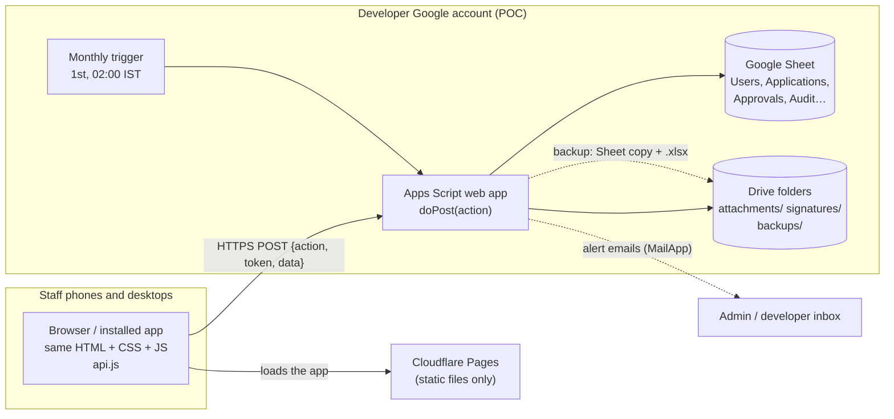

# SwabodhiniCare — POC Design: Google Sheets back end

| | |
|---|---|
| **Relates to** | Main spec `2026-09-15-swabodhinicare-design.md` (v0.5) |
| **Scope map** | `docs/architecture/scope-map.md`: every POC-only, production-only and shared feature and folder |
| **Phase** | Phase 0: POC, tested by every role |
| **Status** | Draft for review |
| **Date** | 2026-09-15 |

> The POC has **all features** of the main spec: roles, the 11-step form, the three approvals, the Director's signature, uploads, reports, Excel, the A4 print, Tamil/English, light/dark and the installable app.
> **Only the back end is different.** Everything the main spec says about screens, the form, the workflow, permissions and UX applies unchanged. This document covers only the differences.

---

## 1. Decisions for the POC

| # | Decision | Choice | Why |
|---|---|---|---|
| P1 | Data store | **One Google Sheet**: one tab per table, one readable column per form answer | Management can read applications directly, and the Sheet *is* the Excel file; free |
| P2 | Server code | **Google Apps Script web app** | Free, nothing to install or patch, runs next to the Sheet |
| P3 | Files | **Private Google Drive folders** (photos, PDFs, signatures, backups) | Free; no card needed (no Cloudflare R2 in the POC) |
| P4 | Screens | **Cloudflare Pages**, static files only (no card) | The same HTML/CSS/JS as the final app; the installable app works |
| P5 | Account and data | **Developer's Google account, test data only** | Fast to iterate; no real child's data until it moves to the NGO account (§12) |
| P6 | Scope | **Every feature of the main spec** | All roles will test the POC |
| P7 | Alert emails | **`MailApp` called directly** by the same Apps Script | No separate mail relay needed, because the back end already is Apps Script |
| P8 | Path to production | Screens call **one API module (`api.js`)** with the same actions in both phases | Moving to Cloudflare later changes the back end, not the screens (§14) |

## 2. What changes compared with the main spec

| Part | Main spec (production) | POC |
|---|---|---|
| Data | Cloudflare D1 (SQLite) | Google Sheet |
| Server | Cloudflare Worker | Google Apps Script web app |
| Files | Cloudflare R2 (card required) | Google Drive folders (no card) |
| Excel | Built in the browser | The Sheet itself, **plus** the same browser-built Excel for filtered reports |
| Monthly backup | Chunked cron job to R2 | Apps Script monthly trigger: copies the Sheet and saves an `.xlsx` to Drive |
| Spend guard (§11.3) | Needed for R2 | **Not needed**: nothing can ever be billed |
| CPU budget (§11.1) | 10 ms per request | Not relevant; Apps Script allows 6 minutes per call |
| Session | `HttpOnly` cookie | Token in the request body, kept in `localStorage` (see §7) |
| Speed | ~100 ms per save | **1–3 s per save.** The screens show *"Saving…"* |
| **Unchanged** | Screens, form schema, workflow rules, roles and permissions, phone-side password hashing, bilingual UX, light/dark, installable app | ← same |

## 3. Architecture



**Saving on one phone and seeing it on another:** every save goes straight into the Sheet through Apps Script. No application data is kept on the phone. Any other phone sees the change the next time it loads a screen (§8).

## 4. Hosting and deployment

- **Screens:** the `public/` folder is deployed to **Cloudflare Pages** (free, no card). It's deployed from the Git repository or with `wrangler pages deploy`.
- **Apps Script web app** deployment settings:
  - *Execute as:* **Me** (the developer account, which owns the Sheet)
  - *Who has access:* **Anyone**. The URL can be reached by anyone, so every action except login must carry a valid session token (§7).
- `public/js/config.js` holds `API_BASE`, the Apps Script `/exec` URL. In production it becomes `/api`.
- The CSP on the pages allows `connect-src https://script.google.com https://script.googleusercontent.com`. Apps Script answers through a redirect to `googleusercontent.com`, and `fetch` follows it automatically.

## 5. API over Apps Script

Apps Script has **one URL**, so every call is a POST to that URL with an `action` name. The actions mirror the endpoints in main spec §9, and the response uses the **same envelope**: `{ ok, data, error }`.

```js
// public/js/api.js (POC)
const res = await fetch(API_BASE, {
  method: "POST",
  // text/plain avoids a CORS preflight, which Apps Script cannot answer
  headers: { "Content-Type": "text/plain;charset=utf-8" },
  body: JSON.stringify({ action: "applications.save", token, data: { id: 42, version: 7, fields } }),
});
const { ok, data, error } = await res.json();
```

| Action | Main spec §9 equivalent |
|---|---|
| `auth.prelogin`, `auth.login`, `auth.logout`, `auth.changePassword` | `/api/auth/*` |
| `me.get`, `me.update` (language, theme) | `GET/PATCH /api/me` |
| `users.list`, `users.create`, `users.update`, `users.resetPassword` | `/api/users*` |
| `applications.list`, `.create`, `.get`, `.save`, `.submit`, `.review`, `.decide`, `.reopen`, `.withdraw` | `/api/applications*` |
| `attachments.upload`, `.get`, `.delete`, `signature.upload` | attachments, `/api/me/signature` |
| `reports.get` | `/api/reports/:name` |
| `admin.backups.list`, `admin.backups.runNow`, `admin.audit.list` | `/api/admin/*` |
| `setup.firstAdmin` `[POC]` | none (production creates the first Admin with a one-time script) |

**First Admin (bootstrap).** No password or key is ever committed; the repository is public.
1. The developer runs `setup()` once in the Apps Script editor. It creates the data Sheet (if `SHEET_ID` is empty), the tabs, the 4 centres and `HMAC_SECRET`. While no active Admin exists, it also creates a **one-time 12-character setup code** in Script Properties and prints it in the execution log.
2. The first Admin opens the app, enters the setup code, their email and name, and chooses a password. The phone derives the key as usual, and `setup.firstAdmin` creates the account.
3. The code is deleted as soon as it's used. Five wrong codes also delete it, and `setup()` must be run again for a new one. Once an Admin exists, `setup.firstAdmin` always answers `NOT_ALLOWED`.
4. All other staff, including one test account per role, are then created by the Admin in the app.

## 6. Google Sheet layout

| Tab | Columns (header row) | Notes |
|---|---|---|
| `Users` | id, email, name, phone, roles (comma list), centre, password_hash, password_salt, kdf_iterations, must_change_password, preferred_lang, preferred_theme, is_active, failed_logins, locked_until, created_at, updated_at | The password columns are only readable by the script |
| `Sessions` | token_hash, user_id, created_at, last_seen_at, expires_at | Only the SHA-256 of each token is stored |
| `Centres` | id, code, name_en, name_ta, address, is_active | Pre-filled: TVM, VLC, TDP, SLR |
| `Applications` | id, app_no, registration_no, centre, status, applicant_name, dob, gender, suitability, programs, created_by, submitted_at, decided_at, version, created_at, updated_at, **then one column per form field** (`s2_full_name`, `s6_eating`, …) | **Readable by management.** Columns are added automatically from `form-schema.js` when the form changes |
| `Approvals` | id, application_id, stage, action, comment, user_id, form_hash, created_at | The routing slip |
| `Attachments` | id, application_id, kind, drive_file_id, filename, mime, size, uploaded_by, created_at, deleted_at | The files themselves are in Drive |
| `Signatures` | user_id, drive_file_id, uploaded_at | The Director's stored signature |
| `Audit` | id, user_id, action, entity, entity_id, details, created_at | Logins, views, edits, decisions, exports |
| `Config` | key, value | Number counters (`app_seq`, `reg_seq:VLC:2026`), POC settings |
| `BackupLog` | period, status, sheet_copy_id, xlsx_file_id, rows, error, started_at, finished_at | One row per backup |

- Tamil text is stored as typed (Sheets is fully Unicode).
- Dates are stored as ISO text (`2026-09-12T10:42:00+05:30`) so the timezone is never ambiguous.

## 7. Login and sessions on Apps Script

- **Same phone-side hashing as main spec §10.1.** The phone runs PBKDF2 (600,000 rounds). Apps Script only computes `SHA-256(key)` with `Utilities.computeDigest`, which is fast.
- **Fake salt** for unknown emails: `Utilities.computeHmacSha256Signature(email, HMAC_SECRET)`. The secret is kept in **Script Properties**, never in code.
- **Session token:** 32 random bytes, returned at login and sent in the body of every request. Because the API runs on Google's domain, a cookie wouldn't be sent, so the token is kept in `localStorage`.
  - Risk: a script injected into the page could read the token. Mitigations: the strict CSP from main spec §10.2, no `innerHTML`, and a 12-hour idle / 7-day maximum expiry checked on the server.
  - Production goes back to `HttpOnly` cookies.
- Each signed-in request reads the `Sessions` tab. "Last seen" is written at most every 5 minutes, to save Sheet writes. If requests feel slow, a `CacheService` layer can be added (values last up to 6 hours, 100 KB each).
- **Lockout:** 5 failed attempts locks the account for 15 minutes. Apps Script can't see the caller's IP address, so lockout is per account only.
- **Permissions** are checked on the server for every action, using the same role rules as main spec §4.

## 8. Multi-device use and concurrency

- **Freshness:**
  - Every screen loads fresh data when it opens.
  - **My Queue refreshes every 60 seconds** while it's on screen (paused when the phone is locked or the tab is hidden), and has a **Refresh** button.
  - After any save, the screen shows the saved data returned by the server.
- **Two people saving at once:** every write runs inside `LockService.getScriptLock()`. Others wait up to 10 seconds; if a lock can't be obtained, the screen shows *"Busy, trying again"*.
- **No silent overwrites:** each application row has a `version`. A save with an old version is refused: *"Someone else updated this form. Tap to reload."* (main spec §8).
- **Numbers** (`APP-2026-0042`, `SWB/VLC/2026/0013`) come from counters in `Config`, updated inside the lock, so there are never duplicates.

## 9. Photos, PDFs and signatures in Drive

- Folders: `SwabodhiniCare POC/attachments/<app_no>/`, `…/signatures/`, `…/backups/`. All private; **never shared**.
- **Upload:**
  - The phone shrinks photos first (about 300 KB).
  - The file is sent as base64 in the request, because Apps Script can't receive a raw file stream.
  - The script checks the file type from its first bytes, then saves it with `DriveApp`.
  - PDFs up to 5 MB.
- **Viewing:** `attachments.get` checks permissions and returns the file as base64. The screen shows it using a temporary in-memory link. Drive links are never exposed.
- Deleted files are only marked as deleted in the `Attachments` tab. Drive also keeps trashed files for 30 days.

## 10. Excel and reports

- **Raw data:** the `Applications` tab is the register. The owner (and later the NGO Admin) can open the Sheet, or use *File → Download → Microsoft Excel*.
- **In-app reports** (main spec §7): Apps Script reads the rows, filters and counts them, and returns pages of 50. **Download Excel** builds the file in the browser, the same way as in production, so staff see identical behaviour in both phases.
- Staff never get direct access to the Sheet. They only see what their role allows, through the app.

## 11. Backups (automatic, monthly)

```
Trigger: ScriptApp.newTrigger("monthlyBackup").timeBased()
           .onMonthDay(1).atHour(2).inTimezone("Asia/Kolkata").create()

monthlyBackup():
  1. copy the Sheet  → backups/SwabodhiniCare backup 2026-10      (DriveApp makeCopy)
  2. export .xlsx    → backups/SwabodhiniCare backup 2026-10.xlsx (Sheets export URL + ScriptApp.getOAuthToken)
  3. write a BackupLog row (row counts per tab)
  4. delete backups older than 24 months
  5. email Admin + developer: "October backup complete" — or "Backup failed: <reason>"
```

- **Backup now** button on the Admin page runs the same function, so every role can see it work during the POC.
- **Extra undo:** Google Sheets keeps its own **version history** (File → Version history), so any earlier state can be restored within the app's own UI.
- **Restore:** point the `SHEET_ID` Script Property at the backup copy (or copy it back over the live Sheet). The steps will be written up in `docs/runbook.md` and practised once during the POC.
- Attachments stay in Drive. A separate copy of the attachment folders is not part of the POC.

## 12. Security for the POC

- **Test data only** (fictional applicants). No real child's data in the developer's account.
- The Sheet and Drive folders are **never shared**. Staff reach data only through the app.
- The web app URL is public, so every action except `auth.prelogin` / `auth.login` needs a valid token and the right role.
- Secrets (`HMAC_SECRET`, `SHEET_ID`, alert recipients) are kept in Script Properties.
- The Audit tab records logins, views, edits, decisions, exports and backups.
- **Before any real data:**
  - Move the Sheet, script and Drive folders to the NGO's Google account.
  - Create a new `HMAC_SECRET` and reset all passwords.
  - Redeploy the web app and update `API_BASE`.
  - Confirm nothing is shared.

## 13. Code layout (additions to main spec §14)

> The full folder rules (`shared/` vs `poc/` vs `prod/`) are in `docs/architecture/scope-map.md` §1. The POC server lives in `poc/apps-script/`.

```
poc/apps-script/             # Bundled by poc/scripts/build.mjs into one Code.js, pushed with clasp (dev-only)
  appsscript.json            # V8 runtime, timezone Asia/Kolkata, web app: execute as owner, access anyone
  Api.gs                     # doPost router, envelope, sign-in, capability and temporary-password checks
  Store.gs                   # tab ↔ object mapping, columns from the form schema, readable encodings, lock, counters
  Crypto.gs  Auth.gs         # hashing, tokens, constant-time compare; prelogin, login, sessions, password change
  Users.gs  Audit.gs         # profile + staff accounts; audit log
  Setup.gs                   # one-time: data Sheet, tabs, centres, HMAC_SECRET, first-Admin setup code
  Applications.gs  Attachments.gs  Reports.gs  Backup.gs    # later milestones (M5–M9)
poc/scripts/
  source-order.mjs           # load order (shared scripts first), used by the build and the tests
  build.mjs                  # writes build/apps-script/Code.js + appsscript.json (git-ignored)
shared/
  form-schema.js             # plain script (global FORM_SCHEMA): used by browser, Apps Script, Node tests
  workflow.js                # pure state machine (main spec §5): same file in browser, Apps Script, later Worker
  permissions.js             # role rules (main spec §4)
public/js/
  config.js                  # API_BASE: Apps Script URL (POC) → "/api" (production)
  api.js                     # one function per action; hides which back end is used
```

Apps Script doesn't support ES modules, so the `shared/` files are **plain scripts that define a global**. They end with `if (typeof module !== "undefined") module.exports = …` so Node's built-in test runner can load them too.

## 14. Moving to production later

| Stays exactly the same | Changes |
|---|---|
| All screens, CSS, i18n, form schema, workflow rules, permissions, phone-side hashing, Excel builder | `config.js` → `API_BASE = "/api"` and `api.js` sends to Worker routes |
| The data model (tab columns = table columns) | Apps Script → Worker; Sheet → D1; Drive → R2 |
| | A one-time import script: Sheet tabs → D1 tables, Drive files → R2 |
| | Session token → `HttpOnly` cookie |

The decision to move is made **after** the POC, based on §16.

## 15. Testing the POC

| Level | What |
|---|---|
| Unit (`node:test`) | `shared/workflow.js` (every transition), `shared/permissions.js`, form-schema validation, number formats |
| Apps Script | A `testAll()` function run in the editor against a **copy** of the Sheet: login, save with an old version, lock contention, counters, backup |
| End to end (Playwright) | On the deployed POC, with one test account per role, at phone size: the full main path, the send-back loop, Tamil, dark mode, and **saving on one browser then seeing it in a second browser** |

## 16. When the POC is done (exit criteria)

1. Each role finishes their part of the flow (main spec §5) **on their own phone**.
2. A save on one phone is seen on another.
3. A monthly backup is created (via **Backup now** and the real trigger), and one restore is practised.
4. Staff feedback on the form wording, Tamil text and reports has been collected.
5. **Decision:** stay on Sheets for a small pilot, or move to the production design. Main triggers for moving: saves feeling slow, more than ~20 active staff, or real data needing stronger controls.

## 17. Limits to know (consumer Google account, approximate; confirm when building)

| Limit | Value | Effect on the POC |
|---|---|---|
| Run time per call | 6 minutes | Our calls take 1–3 seconds |
| Calls running at the same time | ~30 | Enough for a staff test group |
| Time-driven triggers, total per day | 90 minutes | A backup takes seconds |
| Emails from `MailApp` | 100 recipients/day | Alerts only |
| Sheet size | 10 million cells | 1,000 applications × 150 columns = 150,000 cells |
| Drive storage | 15 GB, shared with that account's Gmail and Photos | Test data is tiny |

## 18. Open questions (POC)

| # | Question | Assumption |
|---|---|---|
| PQ1 | Which staff will test, and for which role? (We need one test account per role at least) | One person per role, one centre (Velachery) |
| PQ2 | How long will the POC run? | 4–6 weeks of testing |
| PQ3 | Who receives backup and alert emails during the POC? | The developer only |
| PQ4 | What are the criteria for "move to production"? | §16 point 5 |
